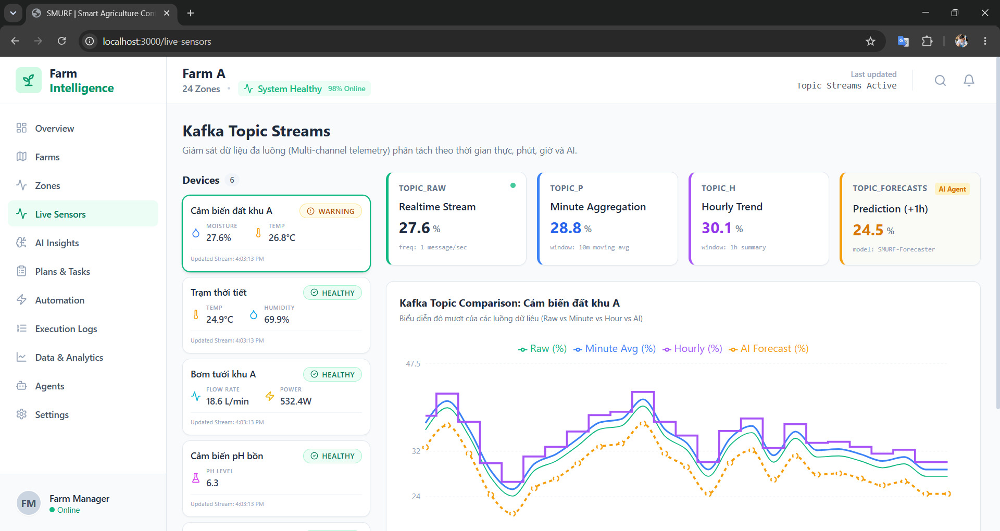
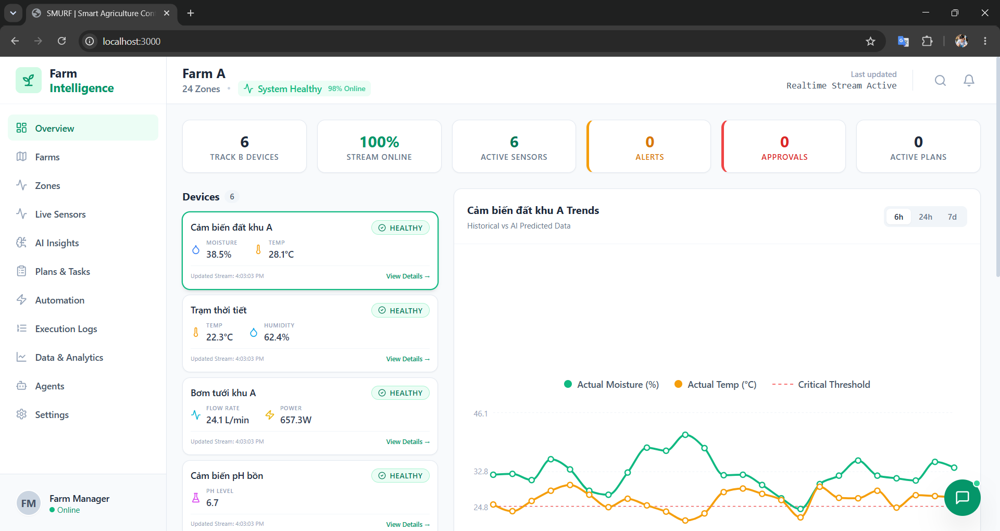

# SMURF PLATFORM 
**AI-Driven Smart Agriculture Operations**

[](#)
[](#)
[](#)
[](#)

> Một hệ thống Event-Driven, Stream Processing và Multi-Agent AI chuyên sâu cho Nông nghiệp Thông minh. Dự án tham gia SEAL Hackathon Summer 2026 (Track B).

---

## 📑 Mục lục
- [Tổng quan](#tổng-quan)
- [Tính năng Cốt lõi](#tính-năng-cốt-lõi)
- [Kiến trúc Hệ thống](#kiến-trúc-hệ-thống)
- [Cấu trúc Thư mục](#cấu-trúc-thư-mục)
- [Công nghệ Sử dụng](#công-nghệ-sử-dụng)
- [Hướng dẫn Cài đặt & Chạy](#hướng-dẫn-cài-đặt--chạy)

---

## Tổng quan

**Smurf Platform** là một nền tảng vận hành nông trại thông minh cấp độ doanh nghiệp (Enterprise-grade). Hệ thống là sự kết hợp chặt chẽ giữa mạng lưới vạn vật kết nối (IoT), xử lý sự kiện thời gian thực (Stream Processing) và hệ sinh thái Trí tuệ Nhân tạo đa tác tử (Multi-Agent AI).

Giải pháp giải quyết bài toán cốt lõi của **Track B**: Hỗ trợ người quản lý nông trại phối hợp hiệu quả giữa điều kiện môi trường canh tác nhiều biến động, tài nguyên sẵn có (nước, năng lượng) và nhân sự ngoài hiện trường để đưa ra các quyết định vận hành, lịch trình tưới tiêu và phản hồi khẩn cấp một cách hoàn toàn tự động và tối ưu.

---

## Tính năng Cốt lõi

- **Xử lý Dữ liệu Thời gian thực (Real-Time Stream Processing):** Tiếp nhận và xử lý hàng nghìn sự kiện cảm biến mỗi giây thông qua Redpanda/Kafka. Ứng dụng các kỹ thuật xử lý luồng nâng cao như Watermarking và Sliding Windows để giải quyết vấn đề dữ liệu trễ (late data) và tính toán tổng hợp.
- **Hệ thống AI Đa tác tử (Multi-Agent AI Core):** Điều phối nhiều đặc vụ AI chuyên trách (Farm Coordinator, Field IoT, Irrigation Planning, Resource Action) dựa trên sức mạnh suy luận của **Google Gemini** để phân tích nguyên nhân và ra quyết định.
- **Cơ chế Dự phòng (Resilient ML Fallback):** Tích hợp các mô hình Học máy cục bộ (Isolation Forest để phát hiện bất thường, XGBoost để dự báo chuỗi thời gian) nhằm đảm bảo hệ thống vận hành liên tục 24/7 ngay cả khi mất kết nối Internet hoặc gián đoạn API của LLM.
- **Control Room Dashboard:** Giao diện trung tâm điều hành hiện đại, chế độ Dark-mode được phát triển bằng React/Next.js. Tích hợp biểu đồ thời gian thực, bản đồ không gian tương tác (Leaflet) và các Thẻ Đề xuất Hành động Thông minh (Smart Action Cards).

---

## Giao diện Hệ thống (Screenshots)

<div align="center">
  
  <p><em>Giao diện Control Room: Giám sát luồng dữ liệu (Kafka Topic Streams) và AI Insights</em></p>
</div>

<br/>

<div align="center">
  
  <p><em>Giao diện Control Room: Theo dõi cảnh báo và biểu đồ xu hướng (Trends)</em></p>
</div>

*(Ghi chú: Bạn hãy lưu 2 ảnh chụp màn hình vào thư mục `docs/assets/` với tên `dashboard_1.png` và `dashboard_2.png` để hiển thị trên GitHub)*

---

## Kiến trúc Hệ thống

Nền tảng được thiết kế theo kiến trúc hướng sự kiện (**Event-Driven Architecture**) bao gồm 5 vi dịch vụ (microservices) được tách rời hoàn toàn:

1. **Ingestion & Stream Engine:** Đăng ký nhận dữ liệu cảm biến thô từ MQTT, làm sạch, tổng hợp qua các cửa sổ thời gian (Sliding Windows) và xuất bản lên Event Bus Redpanda.
2. **Multi-Agent AI Core:** "Bộ não" của hệ thống. Phân tích luồng dữ liệu đã tổng hợp để phát hiện điểm dị thường, dự báo xu hướng và điều phối các chuỗi hành động nông nghiệp.
3. **Web Backend:** Server hiệu năng cao (FastAPI/NestJS) cung cấp RESTful API và luồng WebSocket với độ trễ cực thấp (<100ms).
4. **Web Frontend:** Giao diện Control Room hợp nhất, giúp người quản lý giám sát và thực thi các khuyến nghị từ AI.
5. **Database Persistence:** Lắng nghe toàn bộ Event Topics và ghi vào cơ sở dữ liệu để lưu trữ lịch sử dài hạn (SQLite WAL-mode / TimescaleDB).

---

## Cấu trúc Thư mục

Dưới đây là cấu trúc mã nguồn tổng quan của toàn bộ dự án:

```text
smurf_su2026/
├── Smurf/                             # [Thư mục lõi] Toàn bộ mã nguồn chính của hệ thống
│   ├── services/                      # Cụm Microservices độc lập
│   │   ├── ingestion-stream-engine/   # Xử lý luồng (Watermarking, Windowing)
│   │   ├── ai-agent/                  # Hệ thống AI đa tác tử (Google Gemini)
│   │   ├── fuzzy-agent/               # Hệ thống dự phòng sử dụng Logic mờ (Fuzzy Logic)
│   │   ├── web-backend/               # Máy chủ REST API & WebSocket
│   │   ├── web-frontend/              # Giao diện Next.js Control Room Dashboard
│   │   └── database-saver/            # Tác vụ lưu trữ dữ liệu bền vững (Persistence)
│   ├── simulator/                     # Trình giả lập thiết bị IoT để kiểm thử offline
│   ├── scripts/                       # Các kịch bản tiện ích và hỗ trợ triển khai
│   ├── docker-compose.yml             # File cấu hình triển khai toàn bộ hệ thống bằng Docker
│   └── software_architecture.md       # Tài liệu thiết kế kiến trúc phần mềm chi tiết
├── experiments/                       # Môi trường Jupyter notebooks và thử nghiệm ML
├── test_server/                       # Máy chủ giả lập cho Unit Test
├── .env.example                       # File mẫu cấu hình biến môi trường
└── README.md                          # Tài liệu dự án (File này)
```

---

## Công nghệ Sử dụng

| Phân hệ | Công nghệ Cốt lõi |
| :--- | :--- |
| **Event Streaming** | Redpanda (Kafka-compatible), MQTT, CoAP |
| **Backend & Processing** | Python (FastAPI), Node.js (NestJS) |
| **Frontend UI** | React.js, Next.js, TailwindCSS, Recharts, Leaflet |
| **AI & Machine Learning** | Google Gemini API, Isolation Forest, XGBoost |
| **Cơ sở dữ liệu** | SQLite (WAL-mode) / TimescaleDB |
| **DevOps & Triển khai**| Docker, Docker Compose |

---

## Hướng dẫn Cài đặt & Chạy

Hệ thống được đóng gói hoàn chỉnh bằng Docker giúp việc triển khai trở nên cực kỳ đơn giản.

### Yêu cầu tiên quyết
- [Docker](https://docs.docker.com/get-docker/) (v24.0 trở lên)
- [Docker Compose](https://docs.docker.com/compose/install/) (v2.0 trở lên)

### Bước 1: Cấu hình Môi trường

Bắt đầu bằng việc di chuyển vào thư mục lõi của dự án và khởi tạo file biến môi trường từ file mẫu:

```bash
# Di chuyển vào thư mục lõi
cd Smurf

# Khởi tạo file cấu hình
cp .env.example .env
```

*Lưu ý: Bạn cần mở file `.env` vừa tạo, cập nhật địa chỉ MQTT Broker và khóa bảo mật Google Gemini API Key trước khi chạy.*

### Bước 2: Khởi chạy Hệ thống

Khởi động toàn bộ cụm Microservices (bao gồm Stream Engine, AI Agents, Backend, Frontend, Database, và Redpanda) chỉ với một lệnh duy nhất:

```bash
docker compose up --build -d
```
Tham số `-d` giúp hệ thống chạy ngầm. Quá trình `build` sẽ mất một vài phút trong lần chạy đầu tiên.

### Bước 3: Kiểm tra Dịch vụ

Khi lệnh hoàn tất, hệ thống đã sẵn sàng. Bạn có thể truy cập các thành phần qua các địa chỉ sau:

- **Control Room Dashboard (Giao diện chính):** [http://localhost:3000](http://localhost:3000)
- **API & WebSocket Server:** [http://localhost:8000](http://localhost:8000)
- **Redpanda Console (Quản lý Event Stream):** [http://localhost:8088](http://localhost:8088)

### Dừng Hệ thống

Để tắt và dọn dẹp các container một cách an toàn, sử dụng lệnh:

```bash
docker compose down
```

---
*Dự án được thiết kế và phát triển cho SEAL Hackathon Summer 2026*
