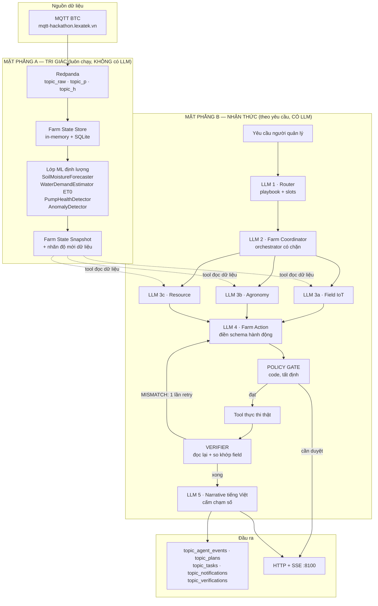
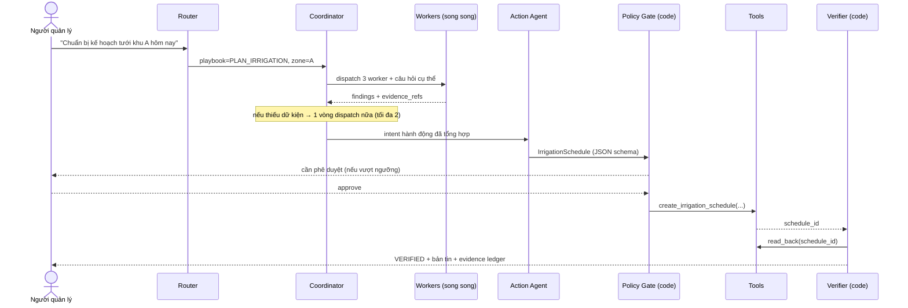

# 01 — Kiến trúc Multi-Agent `agent-core`

> Tài liệu này áp dụng skill `ai-agent-architecture-advisor` (dựa trên "Building Effective AI Agents", Anthropic 12/2024) vào bài toán Track B.

---

## 1. Bối cảnh & vấn đề

### 1.1 Yêu cầu của BTC

Track B đòi hỏi một sản phẩm Multi-Agent thể hiện được chu trình:

```
Nhận yêu cầu → Đọc dữ liệu IoT → Phân công Agent → Phối hợp → Tool/API → Verification → Báo cáo
```

Điều kiện chấp nhận tối thiểu: ≥4/6 thiết bị · ≥3 Agent và một tác vụ cần ≥2 Agent phối hợp · ≥1 quyết định dùng dữ liệu MQTT · có Tool/API tạo lịch tưới/nhiệm vụ/thông báo/báo cáo · **có verification sau hành động** · UI không vỡ trên điện thoại.

Và một ràng buộc loại trực tiếp:

> **"Nếu chỉ trực quan hóa dữ liệu hoặc cảnh báo bằng điều kiện cố định (rule-based) sẽ bị đánh trượt."**

### 1.2 Vì sao cần viết lại thay vì dùng tiếp code trên `main`

`origin/main` đã có 5 file trong `services/ai-agent/src/agents/`, đặt tên đúng theo gợi ý BTC. Nhưng đọc kỹ thì:

| Vấn đề | Bằng chứng |
|---|---|
| **Không có LLM nào được gọi.** Toàn bộ là `if/else` Python | `farm_coordinator_agent.py` chạy pipeline cứng 5 bước; không file nào trong `agents/` import LLM client |
| **Quyết định nông học là hằng số** | `irrigation_planning_agent.py`: `water_amount = deficit * 15.0`; lịch tưới cố định `"Tưới vào 16:30 Chiều"` |
| **Verification là giả** | `farm_action_agent.py` trả `{"verified": True, "message": "Xác minh ... thành công"}` **hardcode**, không đọc lại gì cả |
| **Sai domain** | `services/ai-agent/src/fuzzy_engine.py` đọc `pressure_avg`, `rainfall_avg_mm_h` và sinh `weather_condition`/`synoptic_analysis` — đây là hệ dự báo bão, không phải nông nghiệp |
| **LLM chỉ viết văn** | `gemini_rewriter.py` tên là *Humanizer* — nhận kết quả đã quyết xong rồi diễn đạt lại. LLM không tham gia quyết định nào |

Đối chiếu với dòng in đậm ở §1.1: đây **chính xác** là thứ bị đánh trượt. Verification giả còn nguy hiểm hơn — nếu giám khảo hỏi "hệ thống xác minh bằng cách nào", câu trả lời trung thực là "nó không xác minh".

`agent-core` được sinh ra để thay thế tầng quyết định này bằng một hệ đa agent thật.

### 1.3 Ràng buộc chi phối: model 3B chạy local

LLM của hệ thống là **qwen2.5-3b-instruct** chạy local qua LM Studio. Đây là lựa chọn có chủ đích (xem [ADR-001](adr/ADR-001-llm-provider-strategy.md)), nhưng nó đặt ra một trần năng lực phải tôn trọng:

| 3B **không** làm nổi | 3B làm tốt |
|---|---|
| Agent loop tự do 10+ vòng với 15 tool | Phân loại intent vào 5 nhãn |
| Suy luận nhiều bước ngầm định | Chọn 1 trong 4 tool khi menu rõ ràng |
| Tự bắt lỗi của chính mình | Điền một JSON schema phẳng, hẹp |
| Giữ mạch trong prompt 20k token | Viết 3–5 câu tiếng Việt từ dữ kiện cho sẵn |

Skill cảnh báo rõ: agent tự do khiến **lỗi dồn tích qua nhiều bước**. Với 3B, tốc độ dồn lỗi đủ nhanh để phá hỏng demo.

**→ Nguyên tắc thiết kế xuyên suốt: "LLM đề xuất, code định đoạt".**

| Giao cho LLM | Giữ trong code (tất định) |
|---|---|
| Phân loại yêu cầu → playbook | Thực thi tool, retry, timeout |
| Chọn worker nào cần hỏi, hỏi gì | **Mọi phép tính số** (lượng nước, ET0, dự báo) |
| Cân nhắc đánh đổi nông học, xếp ưu tiên | **Policy Gate an toàn** (mực bồn, ngưỡng phê duyệt) |
| Điền JSON schema của hành động | **Verification** (đọc lại + so khớp field) |
| Viết bản tin tiếng Việt | Resolve `evidence_id` → số liệu thật |

---

## 2. Quyết định kiến trúc (theo quy trình của skill)

### Bước 1 — Đặc điểm bài toán

| Câu hỏi của skill | Trả lời cho Track B |
|---|---|
| Input là gì? | (a) Telemetry MQTT liên tục từ 6 thiết bị; (b) yêu cầu ngôn ngữ tự nhiên của người quản lý |
| Output là gì? | Lịch tưới / phiếu kiểm tra / thông báo / báo cáo — **tạo qua Tool/API**, đã xác minh, kèm bằng chứng dữ liệu |
| Tách thành bước con rõ ràng được không? | *Một phần*. Khung chung cố định (đọc → đánh giá → kiểm tài nguyên → hành động → xác minh) nhưng **tập subtask cụ thể thay đổi** theo loại yêu cầu và theo thiết bị nào đang chết |
| Cần gọi tool/API ngoài không? | **Bắt buộc** — BTC yêu cầu Tool/API + verification |
| Độ trễ / chi phí? | Model local: không tốn tiền nhưng **chậm**. Phải tối thiểu hoá số lần gọi LLM |
| Tin LLM tới đâu? | **Thấp.** 3B + hành động có rủi ro vật lý (bơm nước) → không giao quyền quyết định cuối |

### Bước 2 — Thử phương án đơn giản nhất trước

*Một lời gọi LLM duy nhất có giải quyết được không?*

**Không** — và không phải vì lý do kỹ thuật, mà vì đề bài: BTC yêu cầu ≥3 Agent, ≥2 Agent phối hợp, có Tool/API và verification riêng biệt. Một lời gọi cũng không thể vừa đọc dữ liệu, vừa hành động, vừa tự xác minh hành động của chính nó một cách đáng tin.

Nhưng nguyên tắc "đơn giản nhất trước" vẫn được giữ ở cấp độ *từng bước*: **mỗi lần gọi LLM chỉ làm đúng một việc**, với menu tool ≤ 4 và prompt < ~2000 token.

### Bước 3 — Workflow hay Agent?

|  | Ủng hộ | Phản đối |
|---|---|---|
| **Agent tự do** | Linh hoạt, xử lý được yêu cầu lạ | 3B không kham nổi · lỗi dồn tích · không predictable khi demo · hành động tưới có rủi ro thật |
| **Workflow thuần** | Ổn định, dễ debug, rẻ | Tập subtask *không* cố định (khu nào, thiết bị nào chết, cần hỏi thêm gì) |

→ **Hybrid nghiêng Workflow**: khung điều phối tất định trong code, nhưng chèn các điểm quyết định do LLM đảm nhiệm. Cụ thể là 4 pattern ghép lại:

| Tầng | Pattern | Vì sao chọn (map về đặc điểm bài toán) |
|---|---|---|
| **Router** | `Routing` | Có nhiều *loại* input khác biệt (lập kế hoạch / kiểm tra phiên tưới / sự cố thiết bị / báo cáo / hỏi dữ liệu), mỗi loại cần playbook và prompt riêng để tối ưu |
| **Coordinator → Workers** | `Orchestrator-workers` (**có chặn**) | Số subtask không đoán trước được — nhưng menu worker **cố định** và số vòng dispatch **bị giới hạn cứng**, vì 3B |
| **Workers** | `Parallelization / sectioning` | Field IoT · Agronomy · Resource độc lập nhau → chạy song song, cắt latency (rất quan trọng với model local) |
| **Verifier** | `Evaluator-optimizer` | Có tiêu chí đúng/sai **rõ ràng và kiểm được bằng code** → đọc lại, so khớp, 1 lần retry kèm feedback, rồi escalate cho người |

> **Lưu ý phân biệt** (skill nhấn mạnh): đây là Orchestrator-workers chứ không phải Parallelization thuần, vì Coordinator *tự quyết* hỏi worker nào và hỏi gì dựa trên input cụ thể — subtask không được định sẵn. Nhưng khác với Orchestrator-workers "chuẩn", **menu worker của mình là đóng** và số vòng bị chặn ở 2. Đây là nhượng bộ có ý thức cho model 3B.

---

## 3. Sơ đồ hệ thống

### 3.1 Hai mặt phẳng

Tách bạch **tri giác** (luôn chạy, rẻ, tất định) khỏi **nhận thức** (theo yêu cầu, đắt, có LLM). Đây là quyết định quan trọng nhất về hiệu năng: nếu gọi LLM cho mỗi window telemetry thì model local sẽ nghẹt ngay.



### 3.2 Vòng đời một yêu cầu (đường đi chính)



---

## 4. Roster Agent — và vì sao từng agent *thực sự* cần thiết

> BTC: *"Đội thi được tự do thay đổi tên, số lượng và kiến trúc Agent, miễn ... chứng minh mỗi Agent có vai trò thực sự cần thiết."*

Bảng này là câu trả lời cho câu hỏi phản biện đó. Tiêu chí để một agent tồn tại: **nó phải sở hữu một bộ tool mà không agent nào khác có, và chặn được một kiểu lỗi cụ thể.**

| Agent | Tool độc quyền | Kiểu lỗi nó chặn | Bỏ đi thì hỏng gì |
|---|---|---|---|
| **Router** | *(không có tool — chỉ phân loại)* | Prompt quá tải | Coordinator phải gánh mọi loại yêu cầu trong một prompt → 3B loạn, chọn sai playbook |
| **Farm Coordinator** | `dispatch_worker`, `merge_findings` | Phối hợp cứng nhắc | Quay về pipeline 5 bước hardcode như code hiện tại — mất chính thứ BTC chấm |
| **Field IoT Agent** | `get_device_snapshot`, `get_metric_series`, `get_freshness_report` | **Bịa số khi cảm biến chết** | Không ai gác độ mới dữ liệu → hệ thống tự tin kết luận trên dữ liệu cũ → **trượt Kịch bản 3** |
| **Agronomy Agent** | `estimate_water_demand`, `forecast_soil_moisture`, `get_crop_profile` | Quyết định bằng ngưỡng cố định | Mất toàn bộ phần định lượng → tụt về rule-based → **trượt tiêu chí "Hiệu quả AI" (25%)** |
| **Resource Agent** | `get_water_balance`, `get_pump_health`, `get_staff_roster` | Kế hoạch bất khả thi | Lập lịch tưới 800L khi bồn còn 15%, hoặc giao việc cho người không có ca |
| **Farm Action Agent** | `create_irrigation_schedule`, `create_inspection_ticket`, `send_notification`, `generate_report` | Không có đầu ra hành động | Không có Tool/API tạo tác vụ — **vi phạm điều kiện chấp nhận bắt buộc** |
| **Verifier** | `read_back`, `diff_against_intent`, `audit_evidence` | **Xác minh giả** | Lặp lại đúng lỗi của code hiện tại → mất điểm "Độ tin cậy & An toàn" (20% chung kết) |

**Đáp ứng điều kiện BTC:** 7 agent ≥ 3 ✅ · Kịch bản 1 huy động Coordinator + Field IoT + Agronomy + Resource + Action + Verifier = 6 agent phối hợp trong 1 tác vụ ≥ 2 ✅

---

## 5. Hai cơ chế đặc thù (điểm khác biệt của thiết kế này)

### 5.1 Evidence Ledger — chống bịa số ở tầng cấu trúc

**Vấn đề:** dặn LLM "đừng bịa số" trong system prompt là biện pháp yếu, đặc biệt với model 3B.

**Giải pháp:** làm cho việc bịa số trở nên *bất khả thi về mặt cấu trúc*.

1. Mỗi lần một tool đọc dữ liệu, nó ghi một bản ghi vào Evidence Ledger:
   ```
   {evidence_id, device_id, metric, value, unit, observed_at, age_sec,
    freshness, source_topic, window_type}
   ```
2. Thứ trả về cho LLM **không chứa giá trị số thô ở vị trí LLM có thể copy tự do** — nó là bảng markdown kèm `evidence_id` cho từng ô.
3. Schema đầu ra của mọi agent **không có field kiểu số cho giá trị cảm biến**. Muốn nhắc tới một số đo, LLM *bắt buộc* phải ghi `evidence_refs: ["EV-8823"]`.
4. Khi render bản tin cuối, **code** resolve `EV-8823` → giá trị thật.

**Hệ quả:** một con số xuất hiện trong báo cáo mà không có `evidence_id` tương ứng là điều không thể xảy ra — không phải vì LLM ngoan, mà vì không có chỗ nào cho nó đi qua. Verifier kiểm tra lại điều này lần nữa (`audit_evidence`).

→ Đáp thẳng 2 yêu cầu BTC: *"trình bày rõ dữ liệu đã sử dụng"* và *"Thể hiện rõ dữ liệu IoT đã ảnh hưởng đến quyết định nào"*. Chi tiết: [ADR-003](adr/ADR-003-evidence-refs-only.md).

### 5.2 Partial Mode — Kịch bản 3 "dữ liệu hiện trường bị gián đoạn"

Mỗi thiết bị được gắn nhãn độ mới, tính từ `event_time` gần nhất:

| Nhãn | Tuổi dữ liệu | Được dùng làm căn cứ cho... |
|---|---|---|
| `FRESH` | < 60s | Quyết định `confident` |
| `STALE` | 60s – 10 phút | Chỉ tham khảo; quyết định phải hạ xuống `tentative` |
| `OFFLINE` | > 10 phút | **Không được** làm căn cứ cho bất kỳ quyết định nào |

`data_completeness = số thiết bị FRESH / 6`. Khi < 1.0:
- Kế hoạch đánh dấu `PARTIAL`
- Coordinator **bắt buộc** tách đầu ra thành `confident_actions` và `needs_verification`
- Action Agent tạo phiếu kiểm tra cho từng thiết bị `OFFLINE`
- Verifier **từ chối** (`MISMATCH`) mọi quyết định `confident` có `evidence_refs` trỏ tới thiết bị `OFFLINE`

Đây là điều kiện *cưỡng chế bằng code*, không phải hướng dẫn trong prompt. BTC quan sát 3 điểm ở Kịch bản 3 — *"Không bịa giá trị mới · Có khả năng tiếp tục tác vụ ở chế độ partial · Có hành động kiểm tra phù hợp"* — cả 3 đều được cơ chế này bao phủ.

---

## 6. Vì sao không dùng framework

Skill khuyến nghị mặc định: gọi thẳng LLM API, vì framework dễ tạo lớp trừu tượng che khuất prompt/response thật → khó debug.

Với bài này lý do còn mạnh hơn:
- **Debug là sống còn.** Model 3B sai thường xuyên; cần nhìn thấy prompt thật và response thật ngay lập tức. LangChain giấu chính hai thứ đó.
- **Transparency là tiêu chí chấm.** UI phải hiện trace từng bước agent. Nếu framework kiểm soát vòng lặp, việc phát ra trace chi tiết trở thành cuộc chiến với framework.
- **Toàn bộ pattern ở trên chỉ cần vài trăm dòng.** Router = 1 lời gọi + phân nhánh. Orchestrator = 1 lời gọi + `asyncio.gather`. Evaluator = 1 vòng `for` chạy tối đa 2 lần.

**Phụ thuộc:** `openai` (client HTTP), `fastapi`, `kafka-python-ng`, `pydantic`. Không framework agent.

---

## 7. Liên kết

- Đặc tả agent & tool chi tiết → [02-agents-and-tools.md](02-agents-and-tools.md)
- Hợp đồng dữ liệu → [03-contracts.md](03-contracts.md)
- Quyết định & lý do → [adr/](adr/)
