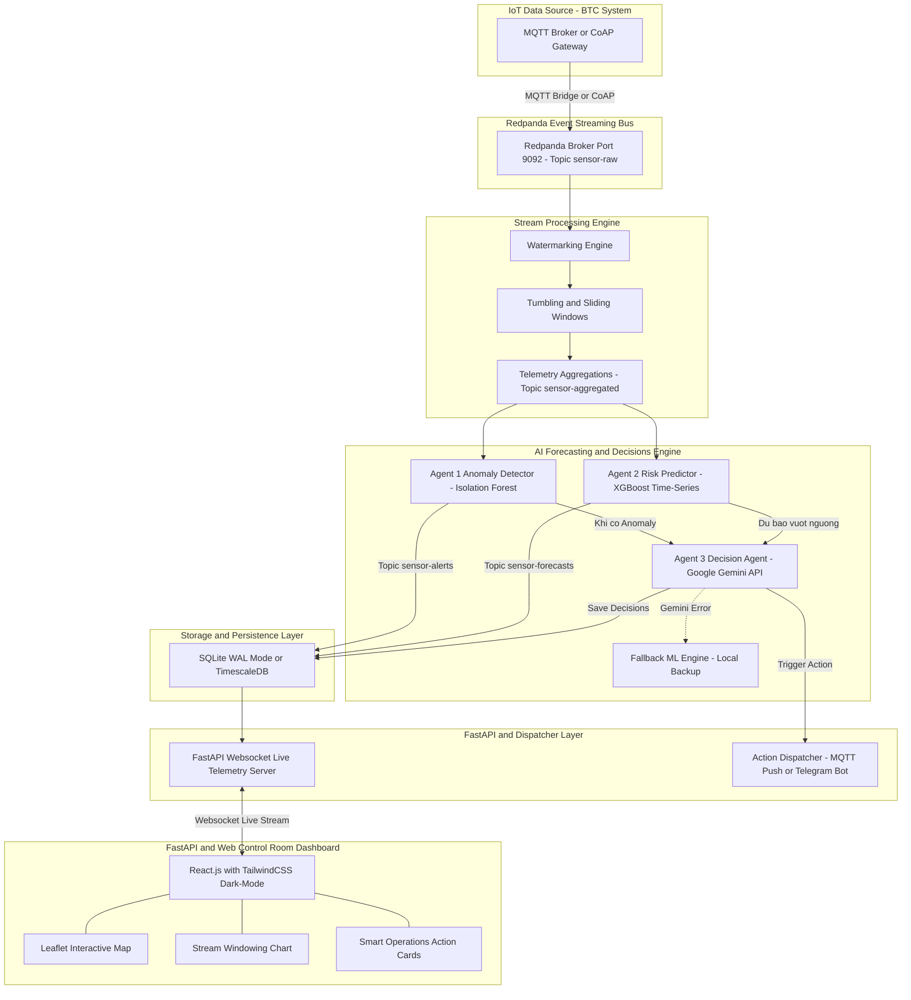

# TÀI LIỆU KIẾN TRÚC PHẦN MỀM (SOFTWARE ARCHITECTURE DOCUMENT)
## Dự án: AI-Driven Smart Operations Platform (SEAL Hackathon Summer 2026)

---

## 1. TỔNG QUAN KIẾN TRÚC HỆ THỐNG (SYSTEM OVERVIEW)

Hệ thống được thiết kế theo kiến trúc **Event-Driven, Stream Processing & Multi-Agent AI Architecture** (Chuẩn kiến trúc Enterprise IoT), tiếp nhận dữ liệu thời gian thực qua Redpanda/Kafka, xử lý luồng (Stream Processing với Sliding Windows & Watermarking), chẩn đoán bất thường qua Multi-Agent AI (Gemini LLM + Fallback ML Engine) và hiển thị lên Real-time Control Room Dashboard.

---

## 2. CHI TIẾT TỪNG TẦNG CÔNG NGHỆ (FULL STACK ARCHITECTURE)

### TẦNG 1: 📡 IoT Data Source & Ingestion Bus (`Redpanda / Kafka`)
- **Giao thức:** MQTT (Cổng `:1883`) hoặc CoAP (Cổng `:5683/UDP`).
- **Event Bus:** **Redpanda Broker** (Port `:9092`). 
  - Đóng vai trò là Message Queue trung tâm, tiếp nhận luồng sự kiện thô và ghi vào **`Topic: sensor-raw`**.
  - Đảm bảo tốc độ xử lý siêu nhanh (C++ Thread-per-core), độ trễ cực thấp (< 1ms) và khả năng mở rộng hàng triệu message/giây.

---

### TẦNG 2: ⚙️ Stream Processing Engine (Xử lý Luồng Dữ liệu)
Đóng vai trò làm sạch, làm mượt và gom dữ liệu chuỗi thời gian trước khi nạp vào AI:
1. **Watermarking (Late Data Handling):** Xử lý dữ liệu cảm biến bị gửi trễ do rớt mạng chốc chốc, đảm bảo không bỏ sót dữ liệu.
2. **Tumbling & Sliding Windows (Cửa sổ trượt):** Gom dữ liệu theo các khoảng thời gian (ví dụ cửa sổ 5-10 giây) để tính toán trung bình trượt.
3. **Telemetry Aggregations:** Đưa dữ liệu đã làm sạch vào **`Topic: sensor-aggregated`**.

---

### TẦNG 3: 🤖 AI Forecasting & Decisions Engine (Hệ thống AI & Fallback)

Hệ thống kết hợp **LLM Cloud (Gemini API)** và **Fallback ML Engine Cục bộ**:

| Component | Công nghệ | Vai trò & Đầu ra |
| :--- | :--- | :--- |
| **Agent 1 (Anomaly Detector)** | `Isolation Forest` | Soi dữ liệu trong Sliding Window 24/7. Phát hiện điểm bất thường lập tức. Bắn vào **`Topic: sensor-alerts`**. |
| **Agent 2 (Risk Predictor)** | `XGBoost Time-Series` | Nhìn vào chuỗi thời gian quá khứ để dự báo chỉ số 5-10 phút tiếp theo. Bắn vào **`Topic: sensor-forecasts`**. |
| **Agent 3 (Decision LLM Agent)** | `Google Gemini API` | Đọc cảnh báo từ Agent 1 & 2 ➔ Phân tích **Root Cause** ➔ Xuất ra **Smart Action Recommendation Cards**. |
| **Fallback ML Engine** | Local Python Rules / ML | **Tự động kích hoạt khi Gemini API mất mạng/lỗi rate limit**, đảm bảo hệ thống KHÔNG BAO GIỜ BỊ CRASH. |

---

### TẦNG 4: 💾 Storage & Persistence Layer
- **Môi trường PoC/Hackathon:** `SQLite Database` bật chế độ `PRAGMA journal_mode=WAL;` (Ghi theo đợt - Batch Write từ In-Memory Buffer).
- **Môi trường Enterprise Scale:** `TimescaleDB` / `InfluxDB` chuyên dụng cho dữ liệu IoT Time-Series.

---

### TẦNG 5: ⚙️ FastAPI & Web Dashboard (Giao diện Control Room)
- **Backend:** `FastAPI` với `WebSocket Live Telemetry Server` đẩy dữ liệu xuống UI với độ trễ < 100ms.
- **Frontend Components (`React.js + TailwindCSS`):**
  1. **Leaflet Interactive Map (`react-leaflet`):** Bản đồ tương tác hiển thị vị trí các Trạm IoT. Trạm bị sự cố sẽ chớp đỏ trên bản đồ.
  2. **Stream Windowing Chart (`Recharts`):** Biểu đồ đường vẽ chuỗi thời gian nảy liên tục.
  3. **Smart Operations Action Cards:** Thẻ màu đỏ hiển thị chẩn đoán nguyên nhân từ Gemini + Nút bấm kích hoạt hành động khắc phục khẩn cấp.

---

## 3. PHÂN CÔNG VAI TRÒ DỰ ÁN (TEAM 5 NGƯỜI)

| Thành viên | Vai trò | Nhiệm vụ chính |
| :--- | :--- | :--- |
| **Member 1** | **Ingestion & Redpanda Dev** | Kết nối MQTT/CoAP, dựng **Redpanda Event Bus** & Topic `sensor-raw`. |
| **Member 2** | **Stream Processing Dev** | Viết module **Stream Processing Engine** (Watermarking & Sliding Window). |
| **Member 3** | **AI & Fallback Engine Dev** | Cài đặt **Agent 1, Agent 2, Agent 3 (Gemini)** và **Fallback ML Engine**. |
| **Member 4** | **Frontend Control Room Dev** | Dựng **React Dashboard**, thêm **Leaflet Map**, Windowing Chart & Action Cards. |
| **Member 5** | **Backend & Team Lead** | Viết **FastAPI WebSocket Server**, SQLite DB, kết nối end-to-end và làm Slide Pitching. |

---
*Tài liệu kiến trúc này được tinh chỉnh khớp 100% với mô hình bài giảng chuyên sâu của Giảng viên.*
